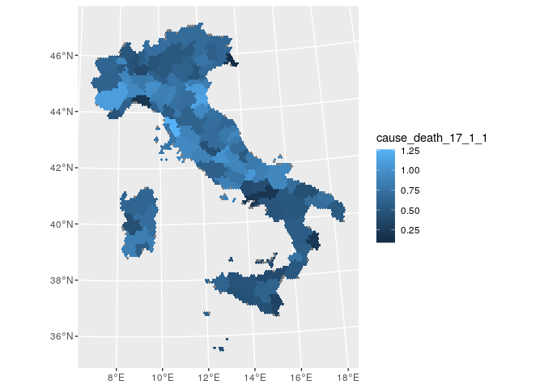

Cause of Death provincial level 2017
================

``` r
require(sf)
```

    ## Loading required package: sf

    ## Linking to GEOS 3.8.0, GDAL 3.0.4, PROJ 7.0.0

``` r
require(dplyr)
```

    ## Loading required package: dplyr

    ## 
    ## Attaching package: 'dplyr'

    ## The following objects are masked from 'package:stats':
    ## 
    ##     filter, lag

    ## The following objects are masked from 'package:base':
    ## 
    ##     intersect, setdiff, setequal, union

``` r
require(tidyr)
```

    ## Loading required package: tidyr

``` r
require(ggplot2)
```

    ## Loading required package: ggplot2

``` r
require(knitr)
```

    ## Loading required package: knitr

``` r
load("../grid/hex_ita_10km.sf.RData")
st_crs(hex_ita_10km.sf) <- st_crs(32632)

# Underlying cause of death - European Short List
read.csv("../cause-death-prov-2017/DCIS_CMORTE1_RES_19062020025140069.csv") %>%
  distinct(CAUSEMORTE_SL,
           Causa.iniziale.di.morte...European.Short.List) %>%
  kable()
```

| CAUSEMORTE\_SL | Causa.iniziale.di.morte…European.Short.List                                                 |
| :------------- | :------------------------------------------------------------------------------------------ |
| 1              | alcune malattie infettive e parassitarie                                                    |
| 1\_3           | epatite virale                                                                              |
| 2\_1\_20       | di cui leucemia                                                                             |
| 2\_2           | tumori non maligni (benigni e di comportamento incerto)                                     |
| 4\_1           | diabete mellito                                                                             |
| 8\_3\_2        | di cui altre malattie croniche delle basse vie respiratorie                                 |
| 9\_1           | ulcera dello stomaco, duodeno e digiuno                                                     |
| 10             | malattie della cute e del tessuto sottocutaneo                                              |
| 11\_2          | altre malattie del sistema osteomuscolare e del tessuto connettivo                          |
| 17\_4          | eventi di intento indeterminato                                                             |
| 2\_1\_16       | di cui tumori maligni della vescica                                                         |
| 2\_1\_19       | di cui morbo di hodgkin e linfomi                                                           |
| 2\_1\_22       | di cui altri tumori maligni                                                                 |
| 8\_1           | influenza                                                                                   |
| 8\_3\_1        | di cui asma                                                                                 |
| 9              | malattie dell’apparato digerente                                                            |
| 9\_3           | altre malattie dell’apparato digerente                                                      |
| 17\_1\_4       | di cui avvelenamento accidentale                                                            |
| 17\_3          | omicidio, aggressione                                                                       |
| 99             | totale                                                                                      |
| 2\_1\_4        | di cui tumori maligni del colon, del retto e dell’ano                                       |
| 2\_1\_7        | di cui tumori maligni della laringe                                                         |
| 2\_1\_10       | di cui tumori maligni del seno                                                              |
| 6              | malattie del sistema nervoso e degli organi di senso                                        |
| 6\_3           | altre malattie del sistema nervoso e degli organi di senso                                  |
| 7\_1\_1        | di cui infarto miocardico acuto                                                             |
| 7\_3           | malattie cerebrovascolari                                                                   |
| 16             | sintomi, segni, risultati anomali e cause mal definite                                      |
| 16\_3          | altri sintomi, segni, risultati anomali e cause mal definite                                |
| 17\_1\_1       | di cui accidenti di trasporto                                                               |
| 2\_1\_15       | di cui tumori maligni del rene                                                              |
| 2\_1\_18       | di cui tumori maligni della tiroide                                                         |
| 2\_1\_21       | di cui altri tumori maligni del tessuto linfatico/ematopoietico                             |
| 7\_2           | altre malattie del cuore                                                                    |
| 8              | malattie del sistema respiratorio                                                           |
| 8\_3           | malattie croniche delle basse vie respiratorie                                              |
| 8\_4           | altre malattie del sistema respiratorio                                                     |
| 17\_1\_3       | di cui annegamento e sommersione accidentali                                                |
| 17\_2          | suicidio e autolesione intenzionale                                                         |
| 17\_5          | altre cause esterne di traumatismo e avvelenamento                                          |
| 1\_2           | aids (malattia da hiv)                                                                      |
| 2              | tumori                                                                                      |
| 2\_1\_2        | di cui tumori maligni dell’esofago                                                          |
| 2\_1\_5        | di cui tumori maligni del fegato e dei dotti biliari intraepatici                           |
| 4              | malattie endocrine, nutrizionali e metaboliche                                              |
| 5              | disturbi psichici e comportamentali                                                         |
| 5\_3           | dipendenza da droghe, tossicomania                                                          |
| 6\_1           | morbo di parkinson                                                                          |
| 11\_1          | artrite reumatoide a osteoartrosi                                                           |
| 12\_1          | malattie del rene e dell’uretere                                                            |
| 14             | alcune condizioni morbose che hanno origine nel periodo perinatale                          |
| 16\_1          | sindrome della morte improvvisa nell’infanzia                                               |
| 2\_1\_8        | di cui tumori maligni della trachea, dei bronchi e dei polmoni                              |
| 2\_1\_14       | di cui tumori maligni della prostata                                                        |
| 2\_1\_17       | di cui tumori maligni del cervello e del sistema nervoso centrale                           |
| 7              | malattie del sistema circolatorio                                                           |
| 7\_1\_2        | du cui altre malattie ischemiche del cuore                                                  |
| 7\_4           | altre malattie del sistema circolatorio                                                     |
| 8\_2           | polmonite                                                                                   |
| 17             | cause esterne di traumatismo e avvelenamento                                                |
| 17\_1\_2       | di cui cadute accidentali                                                                   |
| 17\_1\_5       | di cui altri accidenti                                                                      |
| 2\_1           | tumori maligni                                                                              |
| 2\_1\_3        | di cui tumori maligni dello stomaco                                                         |
| 2\_1\_6        | di cui tumori maligni del pancreas                                                          |
| 2\_1\_9        | di cui melanomi maligni della cute                                                          |
| 5\_1           | demenza                                                                                     |
| 5\_4           | altri disturbi psichici e comportamentali                                                   |
| 6\_2           | malattia di alzheimer                                                                       |
| 7\_1           | malattie ischemiche del cuore                                                               |
| 12\_2          | altre malattie dell’apparato genitourinario                                                 |
| 15             | malformazioni congenite ed anomalie cromosomiche                                            |
| 16\_2          | cause sconosciute e non specificate                                                         |
| 17\_1          | accidenti                                                                                   |
| 1\_1           | tubercolosi                                                                                 |
| 1\_4           | altre malattie infettive e parassitarie                                                     |
| 2\_1\_1        | di cui tumori maligni delle labbra, cavità orale e faringe                                  |
| 3              | malattie del sangue e degli organi ematopoietici ed alcuni disturbi del sistema immunitario |
| 4\_2           | altre malattie endocrine, nutrizionali e metaboliche                                        |
| 5\_2           | abuso di alcool (compresa psicosi alcolica)                                                 |
| 9\_2           | cirrosi, fibrosi ed epatite cronica                                                         |
| 11             | malattie del sistema osteomuscolare e del tessuto connettivo                                |
| 12             | malattie dell’apparato genitourinario                                                       |
| 2\_1\_11       | di cui tumori maligni della cervice uterina                                                 |
| 2\_1\_13       | di cui tumori maligni dell’ovaio                                                            |
| 13             | complicazioni della gravidanza, del parto e del puerperio                                   |
| 2\_1\_12       | di cui tumori maligni di altre parti dell’utero                                             |

``` r
dat_cause_death_prov_2017 <-
  read.csv("DCIS_CMORTE1_RES_19062020025140069.csv") %>%
  dplyr::filter(grepl("IT([A-Z])?\\d{2,3}|ITC4A|ITE1A|ITC4B", ITTER107) &
                  Sesso == "totale" & 
                  TIPO_DATO15 == "MRATE") %>%
  dplyr::select(ITTER107, Territorio, 
                CAUSEMORTE_SL, Value) %>%
  tidyr::pivot_wider(names_from = CAUSEMORTE_SL, 
                     values_from = Value,
                     names_prefix = "cause_death_")
```

``` r
italy.sf <- 
  read_sf("../shapefile/Italy/Limiti01012017_g/ProvCM01012017_g/ProvCM01012017_g_WGS84.shp") %>%
  sf::st_make_valid()

hex_ita_10km.sf$PROVINCIA_2017 <- NA

for (i in hex_ita_10km.sf$hex_id) {
  print(i)
  this_res <- 
    st_intersection(italy.sf, 
                    hex_ita_10km.sf[i,])
  if(nrow(this_res) == 0) next
  hex_ita_10km.sf$PROVINCIA_2017[i] <-
    this_res$DEN_PCM[which.max(st_area(this_res))]
}

hex_cause_death_prov_2017.df <-
  data.frame(
    hex_id = hex_ita_10km.sf$hex_id,
    PROVINCIA_2017 = hex_ita_10km.sf$PROVINCIA_2017,
    stringsAsFactors = F
  )

hex_cause_death_prov_2017.df$PROVINCIA_2017[
  hex_cause_death_prov_2017.df$PROVINCIA_2017 ==
    "Aosta"] <- 
  "Valle d'Aosta / Vallée d'Aoste"
hex_cause_death_prov_2017.df$PROVINCIA_2017[
  hex_cause_death_prov_2017.df$PROVINCIA_2017 ==
    "Massa Carrara"] <- 
  "Massa-Carrara"
hex_cause_death_prov_2017.df$PROVINCIA_2017[
  hex_cause_death_prov_2017.df$PROVINCIA_2017 ==
    "Forli'-Cesena"] <- 
  "Forlì-Cesena"
hex_cause_death_prov_2017.df$PROVINCIA_2017[
  hex_cause_death_prov_2017.df$PROVINCIA_2017 ==
    "Bolzano"] <- 
  "Bolzano / Bozen"

save(hex_cause_death_prov_2017.df, 
     file = "hex_cause_death_prov_2017.df.RData")
```

``` r
load("hex_cause_death_prov_2017.df.RData")

hex_cause_death_prov_2017.df <- 
  merge(hex_cause_death_prov_2017.df, 
        dat_cause_death_prov_2017, 
        by.x = "PROVINCIA_2017",
        by.y = "Territorio",
        all.x = T)

save(hex_cause_death_prov_2017.df, 
     file = "hex_cause_death_prov_2017.df.RData")
```

``` r
load("hex_cause_death_prov_2017.df.RData")

ggplot(merge(hex_ita_10km.sf,
        hex_cause_death_prov_2017.df, 
        by = "hex_id")) +
  geom_sf(aes(fill = cause_death_17_1_1), 
          colour = NA)
```

<!-- -->
