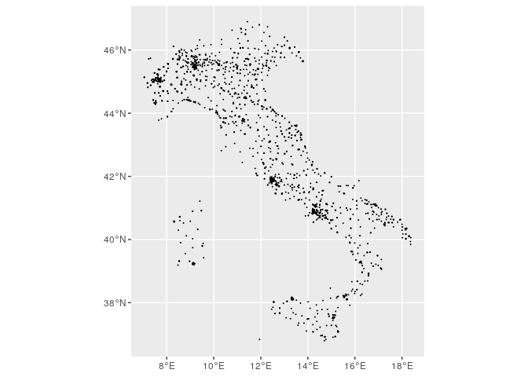
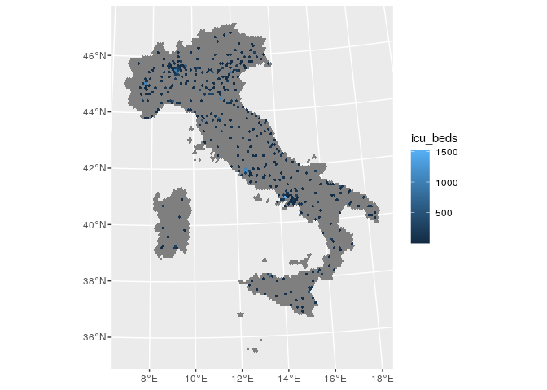

ICU beds
================

``` r
library(ggmap)
```

    ## Loading required package: ggplot2

    ## Google's Terms of Service: https://cloud.google.com/maps-platform/terms/.

    ## Please cite ggmap if you use it! See citation("ggmap") for details.

``` r
library(dplyr)
```

    ## 
    ## Attaching package: 'dplyr'

    ## The following objects are masked from 'package:stats':
    ## 
    ##     filter, lag

    ## The following objects are masked from 'package:base':
    ## 
    ##     intersect, setdiff, setequal, union

``` r
library(readr)
library(sf)
```

    ## Linking to GEOS 3.8.0, GDAL 3.0.4, PROJ 7.0.0

``` r
dat_beds.df <- 
  read_delim("C_17_dataset_96_0_upFile.csv", 
    ";", escape_double = FALSE, locale = locale(encoding = "ISO-8859-1"), 
    trim_ws = TRUE)
  

save(dat_beds.df, file = "dat_icu.df.RData")

address_unique.df <-
  dat_beds.df %>%
  dplyr::distinct(Indirizzo, Comune) %>%
  dplyr::mutate(lon = NA,
                lat = NA)

register_google(key = "")

for (i in 1:nrow(address_unique.df)) {
  print(i)
  res <- 
    geocode(paste0(address_unique.df$Indirizzo[i],
                   ", ",
                   address_unique.df$Comune[i]))
  
  address_unique.df$lon[i] <- res$lon
  address_unique.df$lat[i] <- res$lat
}

address_unique.df$lon[address_unique.df$Indirizzo == "L.G.T. IN SASIA  3" &
                        address_unique.df$Comune == "ROMA"] <- 12.462888
address_unique.df$lat[address_unique.df$Indirizzo == "L.G.T. IN SASIA  3" &
                        address_unique.df$Comune == "ROMA"] <- 41.900789

address_unique.df$lon[address_unique.df$Indirizzo == "Loc Breyan, 1" &
                        address_unique.df$Comune == "SAINT-PIERRE"] <- 7.241320
address_unique.df$lat[address_unique.df$Indirizzo == "Loc Breyan, 1" &
                        address_unique.df$Comune == "SAINT-PIERRE"] <- 45.718011

address_unique.df$lon[address_unique.df$Indirizzo == "Loc Broyan, 1" &
                        address_unique.df$Comune == "SAINT-PIERRE"] <- 7.241320
address_unique.df$lat[address_unique.df$Indirizzo == "Loc Broyan, 1" &
                        address_unique.df$Comune == "SAINT-PIERRE"] <- 45.718011  

address_unique.df$lon[address_unique.df$Indirizzo == "Piazza Nicola Leotta" &
                        address_unique.df$Comune == "PALERMO"] <- 13.358040
address_unique.df$lat[address_unique.df$Indirizzo == "Piazza Nicola Leotta" &
                        address_unique.df$Comune == "PALERMO"] <- 38.104623

address_unique.df$lon[address_unique.df$Indirizzo == "Piazza Nicola Leotta" &
                        address_unique.df$Comune == "PALERMO"] <- 13.358040
address_unique.df$lat[address_unique.df$Indirizzo == "Piazza Nicola Leotta" &
                        address_unique.df$Comune == "PALERMO"] <- 38.104623

address_unique.df$lon[address_unique.df$Indirizzo == "VIA   S. PASQUALE" &
                        address_unique.df$Comune == "CASSINO"] <- 13.844242
address_unique.df$lat[address_unique.df$Indirizzo == "VIA   S. PASQUALE" &
                        address_unique.df$Comune == "CASSINO"] <- 41.505370

address_unique.df$lon[address_unique.df$Indirizzo == "VIA DE GASPERI 1" &
                        address_unique.df$Comune == "PAGANI"] <- 14.620875
address_unique.df$lat[address_unique.df$Indirizzo == "VIA DE GASPERI 1" &
                        address_unique.df$Comune == "PAGANI"] <- 40.747160

address_unique.df$lon[address_unique.df$Indirizzo == "VIA FFAGGIANA 34" &
                        address_unique.df$Comune == "LATINA"] <- 12.901674
address_unique.df$lat[address_unique.df$Indirizzo == "VIA FFAGGIANA 34" &
                        address_unique.df$Comune == "LATINA"] <- 41.443205

address_unique.df$lon[address_unique.df$Indirizzo == "VIA M. MARINE 197" &
                        address_unique.df$Comune == "PALERMO"] <-13.386485
address_unique.df$lat[address_unique.df$Indirizzo == "VIA M. MARINE 197" &
                        address_unique.df$Comune == "PALERMO"] <- 38.106285

address_unique.df$lon[address_unique.df$Indirizzo == "VIA SAN F.SCO D'ASSISI, 194" &
                        address_unique.df$Comune == "RUTIGLIANO"] <- 16.997626
address_unique.df$lat[address_unique.df$Indirizzo == "VIA SAN F.SCO D'ASSISI, 194" &
                        address_unique.df$Comune == "RUTIGLIANO"] <- 41.008877

address_unique.df$lon[address_unique.df$Indirizzo == "VIA S. F. HAHNEMANN" &
                        address_unique.df$Comune == "BARI"] <- 16.888452
address_unique.df$lat[address_unique.df$Indirizzo == "VIA S. F. HAHNEMANN" &
                        address_unique.df$Comune == "BARI"] <- 41.097770

save(address_unique.df, file = "address_unique.df.RData")
```

``` r
load("../grid/hex_ita_10km.sf.RData")
load("dat_icu.df.RData")
load("address_unique.df.RData")

dat_beds.df <- 
  merge(dat_beds.df, address_unique.df, by = c("Indirizzo", "Comune")) 

dat_beds.sf <- 
  st_as_sf(dat_beds.df, coords = c("lon", "lat"), crs = 4326)

ggplot(st_as_sf(address_unique.df, coords = c("lon", "lat"), crs = 4326)) + 
  geom_sf(size = .05)
```

<!-- -->

``` r
st_crs(hex_ita_10km.sf) <- 32632

dat_icu_beds.sf <-
  dat_beds.sf %>%
  dplyr::filter(`Descrizione disciplina` == "TERAPIA INTENSIVA")

res <- 
  unlist(st_within(dat_icu_beds.sf %>% 
                     st_transform(32632), 
                   hex_ita_10km.sf))

dat_icu_beds.sf$hex_id <- res

hex_icu_beds.df <- 
  dat_icu_beds.sf %>%
  dplyr::group_by(hex_id) %>%
  dplyr::summarise(icu_beds = sum(`Totale posti letto`))

st_geometry(hex_icu_beds.df) <- NULL

hex_ita_10km.sf$icu_beds <- 
  hex_icu_beds.df$icu_beds[match(hex_ita_10km.sf$hex_id,
                                 hex_icu_beds.df$hex_id)]

ggplot(hex_ita_10km.sf) + 
  geom_sf(aes(fill = icu_beds), colour = NA)
```

<!-- -->

``` r
save(hex_icu_beds.df, file = "hex_icu_beds.df.RData")
```
