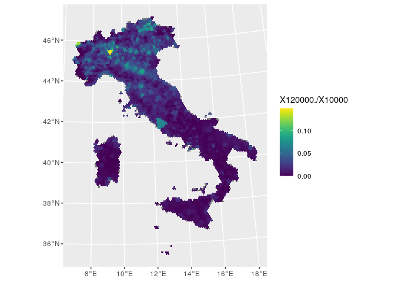

Income
================

Source:
<https://www1.finanze.gov.it/finanze3/analisi_stat/index.php?search_class%5B0%5D=cCOMUNE&opendata=yes>

``` r
library(readr)
library(sf)
```

    ## Linking to GEOS 3.8.0, GDAL 3.0.4, PROJ 7.0.0

``` r
dat.df <- 
  read_delim("Redditi_e_principali_variabili_IRPEF_su_base_comunale_CSV_2018.csv", 
    ";", escape_double = FALSE, trim_ws = TRUE, locale = locale(encoding = "ISO-8859-1"))
```

    ## Warning: Missing column names filled in: 'X51' [51]

    ## Parsed with column specification:
    ## cols(
    ##   .default = col_double(),
    ##   `Codice catastale` = col_character(),
    ##   `Codice Istat Comune` = col_character(),
    ##   `Denominazione Comune` = col_character(),
    ##   `Sigla Provincia` = col_character(),
    ##   Regione = col_character(),
    ##   `Codice Istat Regione` = col_character(),
    ##   X51 = col_character()
    ## )

    ## See spec(...) for full column specifications.

    ## Warning: 7915 parsing failures.
    ## row col   expected     actual                                                                 file
    ##   1  -- 51 columns 50 columns 'Redditi_e_principali_variabili_IRPEF_su_base_comunale_CSV_2018.csv'
    ##   2  -- 51 columns 50 columns 'Redditi_e_principali_variabili_IRPEF_su_base_comunale_CSV_2018.csv'
    ##   3  -- 51 columns 50 columns 'Redditi_e_principali_variabili_IRPEF_su_base_comunale_CSV_2018.csv'
    ##   4  -- 51 columns 50 columns 'Redditi_e_principali_variabili_IRPEF_su_base_comunale_CSV_2018.csv'
    ##   5  -- 51 columns 50 columns 'Redditi_e_principali_variabili_IRPEF_su_base_comunale_CSV_2018.csv'
    ## ... ... .......... .......... ....................................................................
    ## See problems(...) for more details.

``` r
italy.sf <- 
  read_sf("../shapefile/Italy/Limiti01012020/Com01012020/Com01012020_WGS84.shp")

# Edits
dat.df$`Codice Istat Comune`[dat.df$`Denominazione Comune` %in% 
                               c("BREZ","CAGNO'","CLOZ","REVO'", "ROMALLO")] <- "022253"

dat.df$`Codice Istat Comune`[dat.df$`Denominazione Comune` %in% 
                               c("CASTELFONDO", "FONDO", "MALOSCO")] <- "022252"

dat.df$`Codice Istat Comune`[dat.df$`Denominazione Comune` %in% 
                               c( "CARANO", "DAIANO", "VARENA")] <- "022254"

dat.df$`Codice Istat Comune`[dat.df$`Denominazione Comune` %in% 
                               c("FAEDO")] <- "022167"

dat.df$`Codice Istat Comune`[dat.df$`Denominazione Comune` %in% 
                               c("VENDROGNO")] <- "097008"

italy.sf$COMUNE[!italy.sf$PRO_COM_T %in% dat.df$`Codice Istat Comune`]
```

    ## character(0)

``` r
dat.df$`Denominazione Comune`[!dat.df$`Codice Istat Comune` %in% italy.sf$PRO_COM_T]
```

    ## [1] "0"

# Simulation and Sampling

``` r
load("../grid/hex_ita_10km.sf.RData")

brakets <- c('0' = 35, 
             '10000' = 37, 
             '15000' = 39, 
             '26000' = 41, 
             '55000' = 43, 
             '75000' = 45, 
             '120000' = 47,
             "120000+" = 49)

dat.df <- 
  dat.df[,c(3, brakets)] %>% 
  dplyr::group_by(`Codice Istat Comune`) %>%
  dplyr::summarise_all(sum, na.rm = T) %>% 
  as.data.frame()

colnames(dat.df) <- c("PRO_COM_T", names(brakets))

italy.sf <- merge(italy.sf, dat.df, by = "PRO_COM_T")

italy.sf <- 
  italy.sf %>%
  sf::st_make_valid()

hex_income.df <- data.frame()

for (i in hex_ita_10km.sf$hex_id) {
  print(i)

  this_hex.sf <- 
    hex_ita_10km.sf[i,]
  
  res.sf <- 
    st_intersection(this_hex.sf, italy.sf)
  
  res.sf$area <- 
    as.numeric(st_area(res.sf))

  res.df <-
    res.sf %>%
    dplyr::group_by(hex_id) %>%
    dplyr::summarize(X0 = weighted.mean(X0, w = area),
                  X10000 = weighted.mean(X10000, w = area),
                  X15000 = weighted.mean(X15000, w = area),
                  X26000 = weighted.mean(X26000, w = area),
                  X55000 = weighted.mean(X55000, w = area),
                  X75000 = weighted.mean(X75000, w = area),
                  X120000 = weighted.mean(X120000, w = area),
                  X120000. = weighted.mean(X120000., w = area))
  
  st_geometry(res.df) <- NULL
  
  hex_income.df <- rbind(hex_income.df, res.df)
  
}

save(hex_income.df, file = "hex_income.df.RData")
```

``` r
load("../grid/hex_ita_10km.sf.RData")
load("hex_income.df.RData")

library(ggplot2)
library(viridis)
```

    ## Loading required package: viridisLite

``` r
hex_ita_10km.sf$X10000 <- 
  hex_income.df$X10000[match(hex_ita_10km.sf$hex_id, hex_income.df$hex_id)]

hex_ita_10km.sf$X120000. <- 
  hex_income.df$X120000.[match(hex_ita_10km.sf$hex_id, hex_income.df$hex_id)]

ggplot(hex_ita_10km.sf) + 
  geom_sf(aes(fill = X120000. / X10000), colour = NA) +
  scale_fill_viridis()
```

<!-- -->
